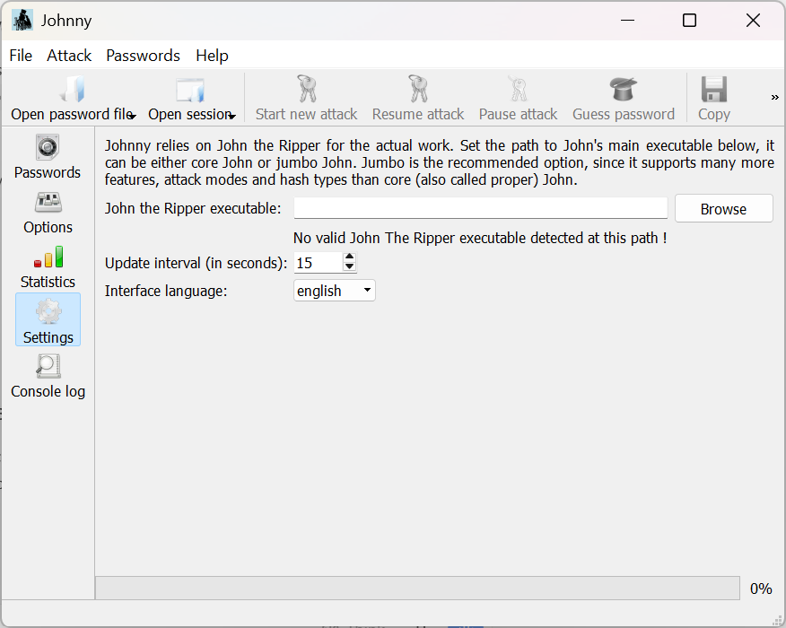
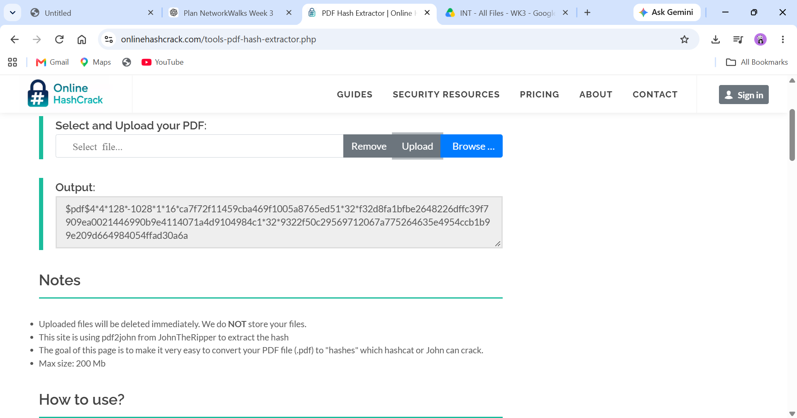
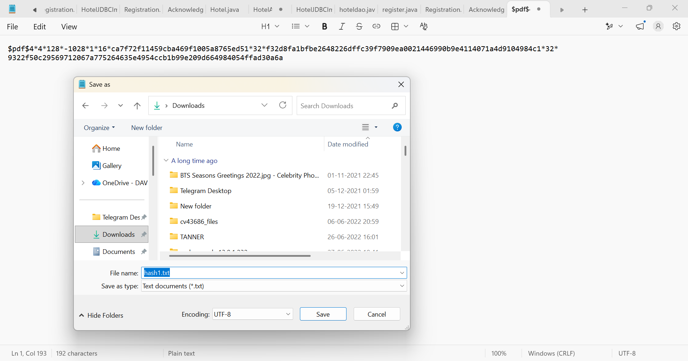
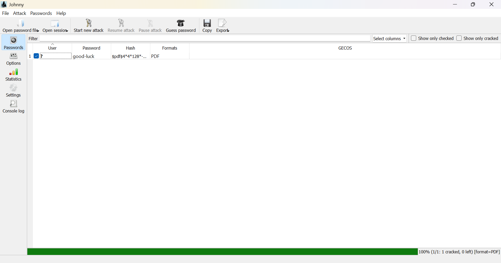
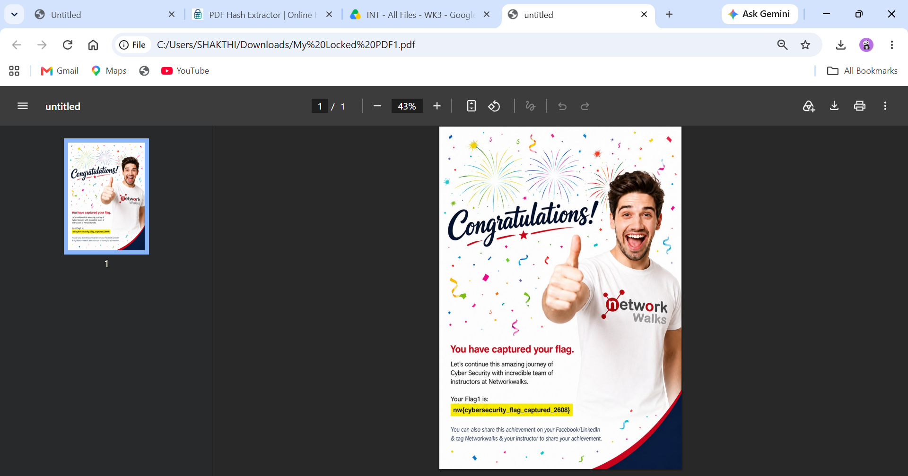

# NETWORKWALKS-B083-WK3-CYBERSECURITY

## 🔐 Password Cracking with JTR & NetworkWalks Tools

---

## 📌 Project Overview

This repository documents **Week 3** of the NetworkWalks Cybersecurity & Ethical Hacking training program.

The practical focused on understanding **password-protected PDF files, PDF hash extraction, dictionary-based password recovery, and password security** using:

- John the Ripper (JTR)
- Johnny GUI
- PDF hash extraction
- NetworkWalks Hash Calculator
- NetworkWalks Password Cracker
- Wordlists

All activities were performed in an authorized cybersecurity training environment using the provided laboratory files.

---

# 🎯 Objectives

The main objectives of this practical were to:

- Understand password-protected PDF files.
- Extract crackable PDF password hashes.
- Configure John the Ripper using Johnny.
- Perform password recovery using a wordlist.
- Use the NetworkWalks Hash Calculator.
- Use the NetworkWalks Password Cracker.
- Verify recovered passwords by opening the protected PDF files.
- Document the complete practical workflow using screenshots.
- Understand the importance of strong and unique passwords.

## 🧩 Module 1: Password Cracking with JTR

### Task 1 — Install and Launch Johnny

The Johnny graphical interface for John the Ripper was installed and launched to begin the PDF password-recovery exercise.

**Result:** Johnny was successfully launched and the John the Ripper executable configuration screen was displayed.

---

### Task 2 — Configure John the Ripper

The John the Ripper executable from the extracted JtR package was configured in Johnny by selecting the appropriate `john.exe` file.

**Result:** Johnny successfully detected the John the Ripper executable and was ready for the password-recovery process.

---

### Task 3 — Extract the PDF Hash

The protected PDF was uploaded to a PDF hash extraction utility to generate a crackable PDF hash.

**Result:** A `$pdf$...` formatted hash was successfully extracted from the protected PDF.

---

### Task 4 — Save the Extracted Hash

The extracted PDF hash was copied and saved as a text file named `hash1.txt` for use with John the Ripper.

**Result:** The extracted PDF hash was successfully saved as `hash1.txt`.

---

### Task 5 — Crack the PDF Password Using Johnny

The saved PDF hash was loaded into Johnny and John the Ripper was used to perform the password-recovery process against the provided training PDF.

**Result:** The password was successfully recovered as:

`good-luck`

Johnny displayed:

`1 cracked, 0 left [format=PDF]`

---

### Task 6 — Verify the Recovered Password

The recovered password was entered into the protected PDF to verify that the password was correct.

**Result:** The protected PDF was successfully unlocked and the NetworkWalks training flag was displayed.

**Captured Flag:**

`nw{cybersecurity_flag_captured_2608}`

---

